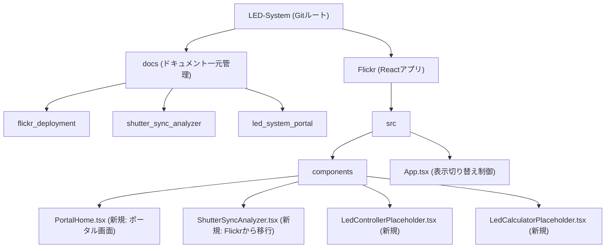

# LEDツール複数開発用ポータル構築およびGit管理一元化の実装計画

LED関連の複数ツールの開発に向けた、ポータル（リンク）ページの作成、画面遷移の実装、およびプロジェクト全体のGit管理を一元化するための実装計画です。

---

## ユーザーレビューが必要な項目

> [!IMPORTANT]
> **Gitリポジトリのルート移動について**
> 現在、`.git` リポジトリは `Flickr/` ディレクトリ内にのみ配置されています。これを全体のルートである `LED-System/` に移動し、`.gitignore` をルート用に調整します。これにより、今後追加される他のツールやドキュメントも含めて一元的にGit管理（コミット）できるようになります。このディレクトリ構造 of 変更についてご確認ください。

> [!NOTE]
> **複数ツールの遷移方式について**
> 複雑な外部ルーティングライブラリの新規追加を避け、現在のVite + React SPA構成を活かして、コンポーネントの状態（`currentView`）を用いたシンプルな画面切り替えでポータルおよび複数ツールを実装します。これにより、アプリのビルドとDocker構成（ポート: `3003`、パス: `/flickr/`）を維持したまま、将来的なツール追加が容易になります。

---

## 提案される変更

プロジェクト構成を以下のように整理・変更します。

---

### 1. インフラ & リポジトリ構成 (Git・ディレクトリ整理)

#### [MODIFY] [.gitignore](file:///Users/seiji/Antigravity-1/LED-System/.gitignore)
- `Flickr/.gitignore` をルート `/Users/seiji/Antigravity-1/LED-System/.gitignore` にコピーし、サブディレクトリ配下の `node_modules` や `dist` も対象になるようパスを調整します。

#### [DELETE] [Flickr/.git](file:///Users/seiji/Antigravity-1/LED-System/Flickr/.git)
- `Flickr/.git` ディレクトリをルートに移動し、ルートレベルで `git init` された状態（共通リポジトリ）にします。

#### [DELETE] [Flickr/docs](file:///Users/seiji/Antigravity-1/LED-System/Flickr/docs)
- 現在のドキュメントディレクトリをルート直下 `/Users/seiji/Antigravity-1/LED-System/docs` に移動し、構成を整理します。

---

### 2. ポータル & 画面切り替え機能 (Flickr Web App)

#### [NEW] [PortalHome.tsx](file:///Users/seiji/Antigravity-1/LED-System/Flickr/src/components/PortalHome.tsx)
- LEDツールのポータル（リンク）画面となるコンポーネントです。
- ガラスモルフィズムを用いた美しいプレミアムカードUIを採用し、各ツール（シャッター同期診断、LEDコントローラー、信号計算機）の紹介と起動ボタンを配置します。

#### [NEW] [ShutterSyncAnalyzer.tsx](file:///Users/seiji/Antigravity-1/LED-System/Flickr/src/components/ShutterSyncAnalyzer.tsx)
- 現在の `App.tsx` 内にあるシャッター同期診断ツール（ShutterSync Quick Analyzer）のメインロジックおよびUI（DiagnosticForm, ExposureVisualizer, DiagnosticResultなど）を移行し、一つのコンポーネントとして独立させます。

#### [NEW] [LedControllerPlaceholder.tsx](file:///Users/seiji/Antigravity-1/LED-System/Flickr/src/components/LedControllerPlaceholder.tsx)
- 将来開発予定の「LED Controller」ツールのプレースホルダー（ダミー）画面です。美しいUIで、今後の開発の方向性を示します。

#### [NEW] [LedCalculatorPlaceholder.tsx](file:///Users/seiji/Antigravity-1/LED-System/Flickr/src/components/LedCalculatorPlaceholder.tsx)
- 将来開発予定の「LED Signal Calculator」ツールのプレースホルダー画面です。

#### [MODIFY] [App.tsx](file:///Users/seiji/Antigravity-1/LED-System/Flickr/src/App.tsx)
- `currentView`（`'portal' | 'flickr' | 'controller' | 'calculator'`）の状態を管理し、表示するコンポーネントを切り替えます。
- 画面上部に、ポータルに戻るためのナビゲーションバー（パンくずリスト風）を追加します。

#### [MODIFY] [index.css](file:///Users/seiji/Antigravity-1/LED-System/Flickr/src/index.css)
- ポータル画面やナビゲーションバー、プレースホルダー画面のためのプレミアムなCSSスタイル（グラデーション、シャドウ、ホバー時のインタラクション、トランジション）を追加します。

---

## 検証計画

### 1. 手動検証
- **Git管理の確認**:
  - ルートディレクトリで `git status` を実行し、`Flickr` ディレクトリおよび `docs` ディレクトリが正しく追跡されているか確認します。
- **Webアプリの挙動確認**:
  - `npm run dev` を実行し、ローカル開発サーバー（`http://localhost:5173/flickr/`）でアプリを起動します。
  - ポータル画面から「ShutterSync Quick Analyzer」を選択して起動し、診断機能が正しく動くか、LocalStorageの保存・復元が機能するか確認します。
  - ヘッダーのナビゲーションリンクからポータルへ戻れること、他のプレースホルダーツールへ遷移できることを確認します。

### 2. 自動テスト
- `npm run test` (Vitest) を実行し、既存 of 診断ロジックのテストがパスすることを確認します。
- `npm run build` を実行し、ビルドエラーが発生しないことを確認します。
- `npm run lint` を実行し、Google TypeScript Style Guideに準拠した静的解析でエラーが出ないことを確認します。
