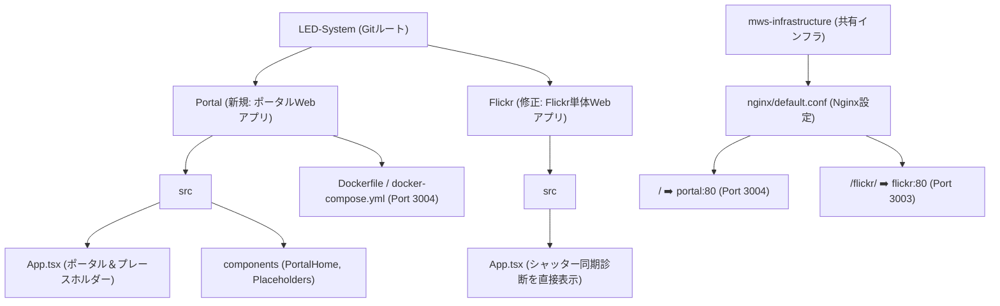

# LEDポータル画面のルートドメイン独立配置とFlickrの分離実装計画

`https://led.mimusubi.tokyo` (ルートパス `/`) にアクセスした際に直接ポータル画面（ツール選択画面）が表示されるようにし、そこから各ツール（第1弾として `/flickr/`）へリンク遷移する構成に変更するための実装計画です。

---

## ユーザー確認事項

> [!IMPORTANT]
> **ポータルとFlickr의 プロジェクト分離について**
> これまでFlickrプロジェクト内に仮配置していたポータル画面（`PortalHome`）を分離し、新しく独立したプロジェクト `Portal` をルートドメイン配信向けに作成します。
> これにより、以下のような画面遷移と構成になります：
> * `https://led.mimusubi.tokyo/` ➡️ 新しい `Portal` アプリ（ポータル画面と、未実装ツールのプレースホルダー）
> * `https://led.mimusubi.tokyo/flickr/` ➡️ 既存の `Flickr` アプリ（シャッター同期診断ツール単体）
> * 各画面間の遷移は、SPA内の状態切り替えではなく、通常のリンク遷移（`window.location.href`）で行います。

---

## 提案される変更

プロジェクトおよびインフラ構成を以下のように整理・変更します。

---

### 1. ポータル専用プロジェクトの新規構築

`/Users/seiji/Antigravity-1/LED-System/Portal` ディレクトリに、新しい Vite + React (TypeScript) プロジェクトを作成します。

#### [NEW] [Portal/Dockerfile](file:///Users/seiji/Antigravity-1/LED-System/Portal/Dockerfile)
* ポータルアプリをビルドし、`nginx:alpine` で配信するための設定。
* ルート（`/`）で動作するため、特別なベースパス設定は不要です。

#### [NEW] [Portal/docker-compose.yml](file:///Users/seiji/Antigravity-1/LED-System/Portal/docker-compose.yml)
* サービス名: `portal`
* ポート設定: `3004:80`（ホストの `3004` ポートをコンテナの `80` ポートにマップ）
* ネットワーク設定: 共有ネットワーク `my-web-server-network` (`external: true`) を利用。

#### [NEW] [Portal/src/components/PortalHome.tsx](file:///Users/seiji/Antigravity-1/LED-System/Portal/src/components/PortalHome.tsx)
* Flickrプロジェクトからポータル画面のコンポーネントを移植。
* 「ShutterSync Quick Analyzer (Flickr)」をクリックした際、`window.location.href = '/flickr/'` で遷移するよう実装。
* 他の開発中ツール（`controller`、`calculator`）は、ポータルSPA内の状態切り替えでプレースホルダーを表示。

#### [NEW] [Portal/src/App.tsx](file:///Users/seiji/Antigravity-1/LED-System/Portal/src/App.tsx)
* ポータル画面 (`PortalHome`) または開発中ツールのプレースホルダー画面を切り替えて表示。

---

### 2. Flickr プロジェクトの修正

`/Users/seiji/Antigravity-1/LED-System/Flickr` にある既存のアプリからポータルコードを除去し、本来の「シャッター同期診断ツール単体」の挙動に戻します。

#### [MODIFY] [Flickr/src/App.tsx](file:///Users/seiji/Antigravity-1/LED-System/Flickr/src/App.tsx)
* ポータル画面 (`PortalHome`) やプレースホルダーコンポーネントの読み込みと表示ロジックを削除。
* 起動時に直接 `ShutterSyncAnalyzer` をレンダリング。
* ヘッダーのナビゲーションで「ポータルに戻る」をクリックした際、`window.location.href = '/'` でポータル（ルート）へ遷移するように変更。

#### [DELETE] 不要なファイルの削除
Flickrプロジェクト内の不要になった以下のファイルを削除します。
* `Flickr/src/components/PortalHome.tsx`
* `Flickr/src/components/LedControllerPlaceholder.tsx`
* `Flickr/src/components/LedCalculatorPlaceholder.tsx`

---

### 3. 共有インフラ設定 (mws-infrastructure) の更新

#### [MODIFY] [nginx/default.conf](file:///Users/seiji/Antigravity-1/mws-infrastructure/nginx/default.conf)
* `led.mimusubi.tokyo` サーバーブロック内の `location /` 設定を新規追加。
* `location /` はコンテナ `portal:80` (ポート3004で動作) へリバースプロキシ（`proxy_pass`）するように設定。
* 既存の `/flickr/` プロキシ設定はそのまま維持。

#### [MODIFY] [web_set/site_structure.xml](file:///Users/seiji/Antigravity-1/mws-infrastructure/web_set/site_structure.xml)
* ポータルアプリケーションを追記し、使用ポート `3004` および公開用URL `https://led.mimusubi.tokyo/` を定義。

---

## 検証計画

### 1. 自動検証 (ビルド & テスト)
* **Portal プロジェクト**: `npm run build` がエラーなく完了すること。
* **Flickr プロジェクト**: ポータルコードを削除した状態で `npm run test` および `npm run build` が正常に通ること。
* **Nginx 設定**: 設定変更後に `nginx -t` (構文チェック) が正常に通ること。

### 2. 手動検証
本番環境でのデプロイを想定した以下の挙動を確認します。
* `https://led.mimusubi.tokyo/` にアクセスし、ポータル画面が表示されること。
* ポータル画面で「ShutterSync Quick Analyzer」をクリックし、`https://led.mimusubi.tokyo/flickr/` へ画面遷移すること。
* Flickrの診断ツールから「← ポータルに戻る」をクリックし、`https://led.mimusubi.tokyo/`（ルート）へ戻れること。
* 開発中の他のツールカードをクリックした場合は、ポータルSPA内でプレースホルダー画面が正しく表示されること。
